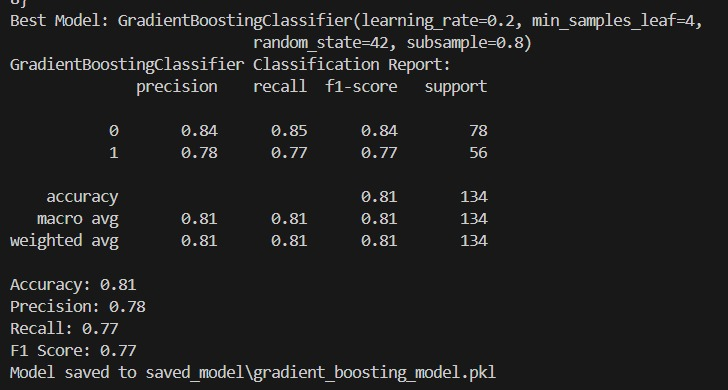
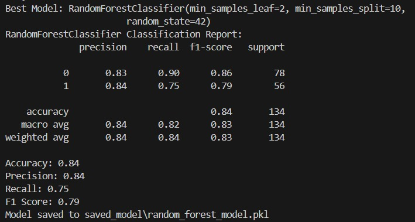

# Project Documentation

## 1. Personal Information
- **Full Name**:
- **Email Address**: 222356K@mymail.nyp.edu.sg

---

## 2. Overview of the Submission Folder

### Folder Structure:
- `conf/`: Configuration files.
  - `catalog.yml`: YAML file specifying paths to datasets
- `data/`: Contains raw, processed, and predicted data files.
  - `01_raw/`: Original raw datasets (e.g., `train.csv`, `test.csv`).
  - `02_processed/`: Processed datasets (e.g., `train_processed.csv`, `test_processed.csv`).
  - `03_predicted/`: Prediction results (e.g., `test_predictions.csv`).
- `saved_model/`: Contains saved machine learning model.
- `eda.ipynb`: EDA python notebook
- `eda.pdf`: PDF version of EDA python notebook
- `image_1`: Image of tuned Gradient Boosting Results
- `image_2`: Image of tuned Random Forest Results
- `src/`: Source code for the project.
  - `__init__.py`: Marks a directory as a Python package which can be imported to other Python files
  - `dataprep.py`: Functions for data preprocessing, feature engineering, and data splitting.
  - `model.py`: Functions for model training, hyperparameter tuning, and evaluation.
- `main.py`: The main script to execute the pipeline.
- `README.md`: This documentation file.
- `requirements.txt`: Lists the required libraries to run the pipeline
- `run.sh`: Shell script to excute the main.py file
---

## 3. Programming Environment and Requirements
### EDA Setup

- **Programming Language**: Python 3.10
- **Operating System**: Google Colab (Ubuntu 18.04)
  - **Libraries for Data Manipulation and Analysis**:
    - `pandas>=2.2.3`
    - `numpy>=1.25.0`
  - **Libraries for Data Visualization**:
    - `seaborn>=0.12.2`
    - `matplotlib>=3.7.2`
  - **Libraries for Statistics**:
    - `scipy>=1.10.0`
  - **Libraries for Machine Learning Preprocessing**:
    - `scikit-learn>=1.2.2`
  - **Additional Libraries**:
    - `warnings` (to suppress warnings during execution)

### Pipeline
- **Programming Language**: Python 3.10.15
- **Operating System**: Windows 10
    - **General Packages**: `pandas>=2.2.3`, `PyYAML>=6.0.2`, `notebook>=7.2.2`
    - **Model Building Packages**: `scikit-learn>=1.5.2`,
    `joblib>=1.4.2`

---

## 4. Key Findings from the Exploratory Data Analysis (EDA)

### Missing Values:
- `Embarked`, `Fare`, and `Age` had missing values

- `Embarked` and `Fare` were imputed using mode due to the low number of missing values

- `Age` was imputed using KNN which used `Pclass`, `Fare`, and `Sex` as features to predict the missing ages

### Dropped Features:
- `Cabin` was dropped due to the high number of missing values (75%)
    - The large amount of missing values meant that imputation will not work on this feature
    - String features is more difficult to impute than numerical features
- `Ticket` 

### Original Features:
- `Sex:` Males had a dramatically `lower survival rate` compared to females. `Sex` plays a big role in determining whether a passenger survives or not.
- `Pclass:` The survival rates of Pclass follows a similar trend to the fare groups. A first class passenger usually has a high fare price ticket, while a third class passenger has a low fare price ticket.
- `SibSp:` The graph shows that as SibSp increases, the survival rate drops significantly. However, from the count values, the SibSp values from 2 to 8 were very low compared to the number of people with SibSp values of 0 or 1.
- `Parch:` The bar graph did not show a consistent trend between Parch and survival rate (only a small increase). Similar to SibSp, Parch values after 2 is in the single digits.

### Feature Engineered Features
- `Age_bins:` To compare the survival rate and the age, using age directly leads to too many categories to form a trend.  
The highest survival rate are children between 0-4 years old while the age group with the lowest survival rate are the elderly between 61-80. The age ranges in between generally have a similar survival rate. Hence, age is an important factor in determining the survival of the passengers.

- `Fare_bins:` Similar to age, the comparision between the survival rate and the fares leads to too many categories to find an overall relationship between the 2 features.
As the fare prices increases, there is a consistent increase in survival rate (from 20% to around 70%).

- `Family_Size:` Family_Size = SibSp + Parch + 1   
This feature was created since SibSp and Parch is talking about the number of family members but split into 2 different feature. The majority of people were travelling alone and has a low survival rate.

After the EDA, the features that had a relationship between survival rate are: `Sex`, `Age_bins`, `Fare_bins`, and `Pclass`  
The features `SibSp`, `Parch`, and `Family_Size` did not show a strong trend between survival rate. However, whether the passengers are alone could attribute to the survival rate.
 

---
## 5. Instructions for Executing the Pipeline
1. Use an integrated development environment (IDE) (e.g. VSCode, PyCharm)
2. Select python interpreter/ virtual environment
3. Insert the raw data into data/01_raw directory
4. Navigate to the project directory using `cd`
5. Install the required libraries using the following command in the command prompt (PowerShell):
   ```bash
   pip install -r requirements.txt
6. Run the main pipeline using run.sh in Git Bash:
   ```bash
   bash run.sh
---

## 6. Pipeline Logical Steps / Flow

**Step 1**: Load raw data file paths using the paths defined in `catalog.yml`.
   - **Function**: `load_config()` in `main.py`

**Step 2**: Preprocess the datasets by handling missing values (imputation), dropping columns, feature engineering, encoding features, and scaling numerical columns. The processed dataset is saved to a CSV file.
   - **Functions**: 
     - `preprocess_titanic_dataset()` in `dataprep.py`
     - `save_processed_data()` in `dataprep.py`

**Step 3**: Split the training data into training and test sets.
   - **Function**: `split_data()` in `dataprep.py`

**Step 4**: Train multiple models and evaluate them on the test set.
   - **Function**: `train_and_evaluate_models()` in `model.py`

**Step 5**: Perform hyperparameter tuning on the best-performing model (Random Forest).
   - **Function**: `tune_random_forest()` in `model.py`

**Step 6**: Save the tuned model and use it to make predictions on the test data.
   - **Functions**:
     - `save_model()` in `model.py`
     - `train_and_evaluate_model()` in `model.py` (trains and evaluates the final selected model)

**Step 7**: Save predictions to a CSV file.
   - **Function**: `make_predictions_and_save_to_csv()` in `model.py`

---

## 7. Model Selection Explanation
**Imputation of missing values**
- Median
- Median by title
- k-nearest neighbors (KNN)

After experimenting with a few ways to impute the missing age values, **KNN** had the best age distribution curve compared to using median, or the median of different titles (sir, mdm, etc.)

**Model to predict survived feature**

A variety of models were trained and evaluated using the train dataset:
| Model                  | Accuracy | Precision | Recall | F1 Score |
|------------------------|----------|-----------|--------|----------|
| Decision Tree           | 0.77     | 0.72      | 0.73   | 0.73     |
| Logistic Regression     | 0.82     | 0.81      | 0.75   | 0.78     |
| K-Nearest Neighbors     | 0.77     | 0.75      | 0.68   | 0.71     |
| Support Vector Machine  | 0.83     | 0.82      | 0.75   | 0.79     |
| Random Forest           | 0.81     | 0.78      | 0.77   | 0.77     |
| Gradient Boosting       | 0.83     | 0.84      | 0.73   | 0.78     |


Based on the evaluation metrics, `Random Forest` was selected for final tuning due to its balance of accuracy, interpretability, and ability to handle feature variability. Even though gradient boosting had a higher F1 score, random forest was chosen due to the high overall balance of all 4 metrics. Additionally, after the results of tuning both `Random Forest` and `Gradient Boosting` models, `Random Forest` had better metrics overall (results in appendix).

---

## 8. Model Evaluation Metrics

- **Accuracy**: Percentage of correctly identified predictions.
- **Precision**: Proportion of true positives among predicted positives.
- **Recall**: Proportion of true positives among actual positives.
- **F1 Score**: A combination of precision and recall.

Due to the nature of the titanic dataset, precision and recall were prioritised over accuracy, which is less reliable.
A classification also report is generated for the tuned `Random Forest` model, highlighting strengths and weaknesses.

---

## 9. Deployment Considerations

### Model Export and Loading
- **Saving Models**:
  - The trained model is saved using `joblib` in the `save_model()` function. 
  - The model is stored in the `saved_model/` directory with a `.pkl` extension.
  - Example:
    ```python
    joblib.dump(model, 'saved_model/random_forest_model.pkl')
    ```
- **Loading Models**:
  - To load the trained model for inference, use `joblib.load()` in the deployment environment.
  - Example:
    ```python
    model = joblib.load('saved_model/random_forest_model.pkl')
    ```

---

## 10. Appendix
### Tuned Gradient Boosting results:


### Tuned Random Forest results:

---
